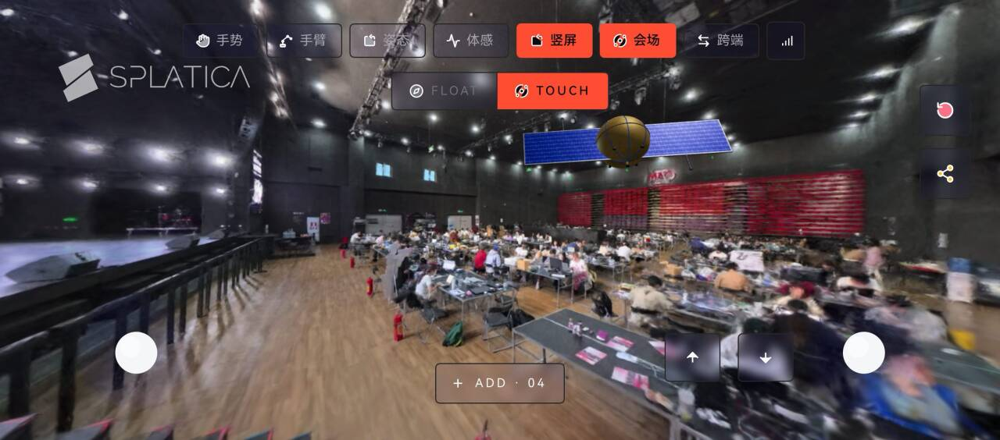
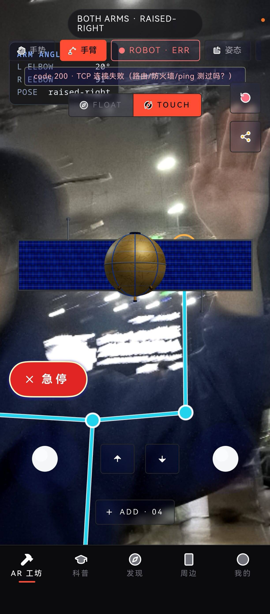
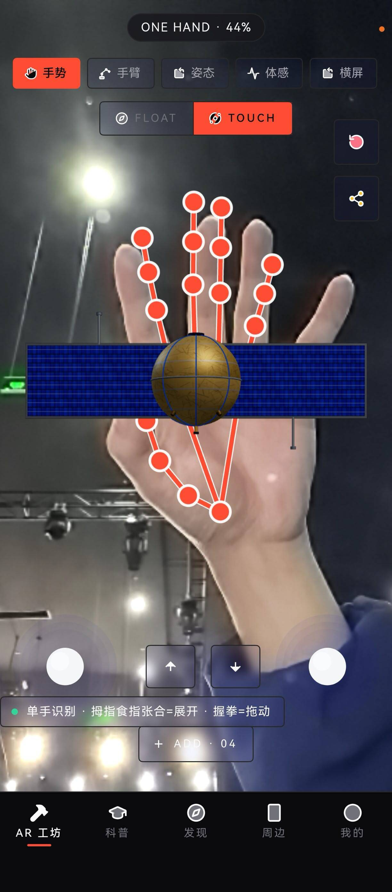
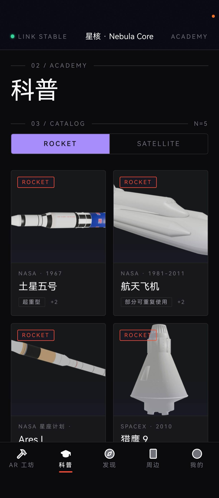
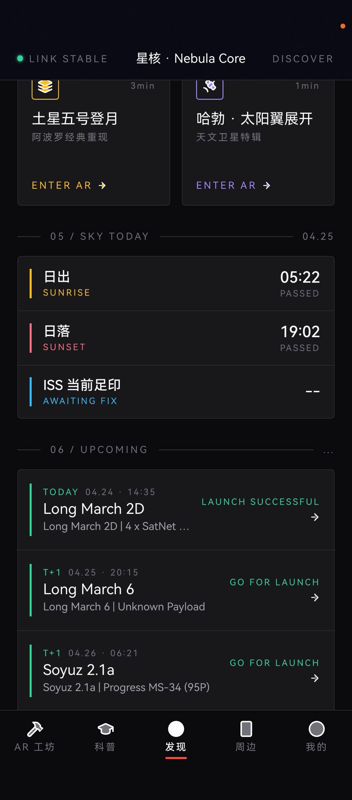

# 喂！星 -- VR × 现实双向联动的太空教育平台

> ASSEMBLE. POINT. MOVE. -- 在手机里搭一颗卫星，举起手，让真的机械臂跟着你的胳膊动。



---

## 我们的题目

"喂！星"是一个 HarmonyOS 手机原生 app，把太空科普做成**可触摸、可联动、能动的太空教育体验**。

这次我们围绕三件事展开：

### 1. VR ↔ 现实联动

把虚拟空间里的手势 / 姿态 / 触控**接到真实世界的机械臂上**。

用户在手机里举起右手，桌面上的 7 自由度机械臂跟着动；手机怎么倾，机械臂末端就怎么转；摇杆做精细调节；红色急停按钮永远在屏幕顶部一按即停。

不是模拟，是**实物在响应**。

### 2. VR ↔ VR 联动（手势）

把摄像头识别的手势接进 AR 工坊里**操作虚拟卫星**。

用户在镜头前两根手指张开 / 合拢 -- 卫星就爆炸图展开 / 收拢，握拳就抓取拖动。整套交互是在虚拟场景里完成，但身体动作来自真实物理空间。

VR 内的物体和 VR 外的身体形成闭环。

### 3. 太空科普

经典卫星科普、轨道演示、卫星知识卡片、虚拟同伴对话 -- 让"卫星"这件事从抽象的天上的小亮点，变成一颗可以拆开、可以了解、可以指挥的真实物体。

---

## 关于 3D 场景的更新

我们之前的 AR 背景使用的是预先建模的 Gaussian Splat 数据集（如国际空间站重建）。

**这次我们升级了流程**：

```
影石 Insta360 X4 实地录场景  ─→  Splatica 处理  ─→  Gaussian Splat 文件  ─→  app 加载
```

任意空间（实验室、教室、太空主题展区）都可以用影石相机扫几分钟，然后通过 Splatica 转成可在手机里浏览的 3D 场景。这样 AR 工坊的"太空背景"不再只能是预制资产，而是可以**贴近用户实际场景**的定制内容。

科普展厅扫一遍 → 用户在自己手机里就能"穿越"过去 / 在那个空间里拼卫星。

---

## 我们实现了哪些功能

### AR 卫星工坊

- 球形金箔本体 + 蓝色太阳翼 + 高增益天线的精细化卫星模型
- 12 类组件实时拼装（平台舱、太阳翼、天线、燃料舱、有效载荷、推进器…）
- 一键爆炸图，每个组件位置一目了然
- 切换多套 Gaussian Splat 场景作为 AR 背景（**会场模式** —— Insta360 X4 拍摄、Splatica
  处理后的实景作为 3D 背景，卫星浮在场景中央，两层独立渲染互不影响）

### 三种自然交互方式（VR ↔ 现实）

**手臂模式**：摄像头识别右臂关节，机械臂跟随末端。

**姿态模式**：手机倾角 → 机械臂末端 6-DOF 姿态。

**双摇杆**：屏幕底部触控盘做精细调节（左 = roll/pitch，右 = yaw）。

三种模式可以同时启用，互不冲突。**急停按钮**永远在屏幕顶部，一按立即冻结。

> 
>
> HUD 实时显示左右肘 / 腕角度和动作分类（如 `BOTH ARMS · RAISED-RIGHT`）；
> 右上角是 ROBOT 状态徽章（连接成功 / 失败一目了然）；红色急停按钮顶在最上层。

### 手势模式（VR ↔ VR）

- MediaPipe Hands 实时识别手部
- 拇指食指距离 → 卫星爆炸度
- 握拳拖动 → 抓取并移动卫星位置
- 双手时计算两手距离做更精细控制

> 
>
> 单手 / 双手识别有不同提示。卫星跟着你的手在画面里漂浮、爆炸、收拢。

### 科普 / 发现 / 周边

- 经典卫星科普：哈勃、ISS、北斗、伽利略、嘉信（含真实 GLB 模型）
- 太空轨道实时演示
- 多端联动：手机/平板/手表 同步火箭设计与控制状态

> 科普页 / 发现页：
>
> 
> 

---

## 跑起来

**手机端**：DevEco Studio 打开 satellite/ → 部署到 HarmonyOS NEXT 设备。

**机械臂端**（如有 woan a1_s）：
```bash
~/.local/bin/micromamba run -n woanarm python tools/robot/teach_monitor.py
```

启动后按 `i` 让机械臂到舒展位姿，然后在手机里打开手臂或姿态模式即可联动。

**Splatica 场景接入**：Insta360 录场景 → Splatica 转 Gaussian Splat → 把 .splat 文件放到 `entry/src/main/resources/rawfile/three/scenes/` → 在 app 里切换场景即可。

具体技术接入文档见 `tools/README.md`。

## 未来规划

| 阶段 | 内容 |
|------|------|
| 第一阶段（当前） | 三种交互模式 + 机械臂联动 + Splatica 场景接入 |
| 第二阶段 | 视觉闭环 -- 摄像头观察机械臂实际位姿，自动纠错 |
| 第三阶段 | 自然语言遥控 -- "把卫星举到桌面右边" 直接听懂 |
| 第四阶段 | 多人协同 -- 多人各控一只手臂，多机器人协作；多场景 Splat 拼接形成扩展太空体验 |

## License

MIT

## 致谢

### 特别鸣谢

- **HarmonyOS · 鸿蒙生态** -- 提供原生设备能力（NetStack、AR Engine、DeviceManager、跨端协同），整套体验只有在鸿蒙系统上才能这么自然地把传感器 / 摄像头 / 多端同步串到一起。
- **影石 Insta360 X4** -- 让任意空间在几分钟内变成可在手机里走进去的 3D 场景。是我们 AR 工坊"自定义太空背景"流程里不可替代的入口设备。
- **卧安机械臂（WoanArm a1_s）** -- 7 自由度桌面机械臂 + Python SDK，让"手机里挥手 → 桌上一台真机器人跟着动"这个 demo 从想法变成了实物。

### 其他

- **AttraX Spring Hackathon** 主办方
- **Splatica** Gaussian Splat 创作工具
- **MediaPipe** by Google
- **three.js** community
- Lucide icons

---

**项目名称**：喂！星
**参赛赛事**：AttraX Spring Hackathon
**Tag**：`#AttraX_Spring_Hackathon`
